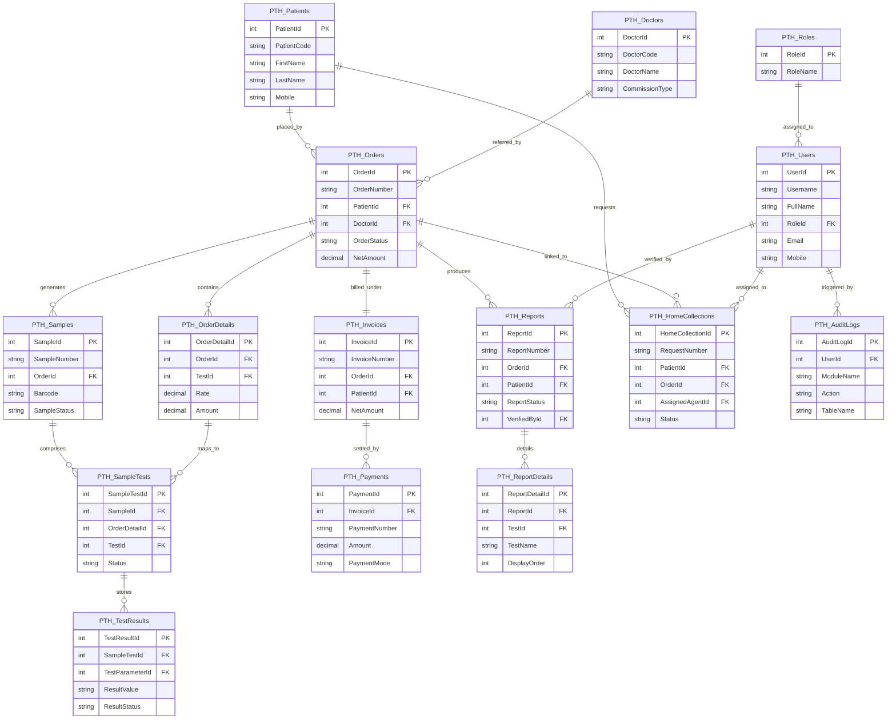

# Patholab Database Schema
## Entity Relationship Diagram (ERD)

Below is the database table schema structure and entity relationship mapping for the central SQL database.

```mermaid
erDiagram
    PTH_Roles {
        int RoleId PK
        string RoleName
    }
    PTH_Users {
        int UserId PK
        string Username
        string FullName
        int RoleId FK
        string Email
        string Mobile
    }
    PTH_Patients {
        int PatientId PK
        string PatientCode
        string FirstName
        string LastName
        string Mobile
    }
    PTH_Doctors {
        int DoctorId PK
        string DoctorCode
        string DoctorName
        string CommissionType
    }
    PTH_Orders {
        int OrderId PK
        string OrderNumber
        int PatientId FK
        int DoctorId FK
        string OrderStatus
        decimal NetAmount
    }
    PTH_OrderDetails {
        int OrderDetailId PK
        int OrderId FK
        int TestId FK
        decimal Rate
        decimal Amount
    }
    PTH_Samples {
        int SampleId PK
        string SampleNumber
        int OrderId FK
        string Barcode
        string SampleStatus
    }
    PTH_SampleTests {
        int SampleTestId PK
        int SampleId FK
        int OrderDetailId FK
        int TestId FK
        string Status
    }
    PTH_TestResults {
        int TestResultId PK
        int SampleTestId FK
        int TestParameterId FK
        string ResultValue
        string ResultStatus
    }
    PTH_Invoices {
        int InvoiceId PK
        string InvoiceNumber
        int OrderId FK
        int PatientId FK
        decimal NetAmount
    }
    PTH_Payments {
        int PaymentId PK
        int InvoiceId FK
        string PaymentNumber
        decimal Amount
        string PaymentMode
    }
    PTH_Reports {
        int ReportId PK
        string ReportNumber
        int OrderId FK
        int PatientId FK
        string ReportStatus
        int VerifiedById FK
    }
    PTH_ReportDetails {
        int ReportDetailId PK
        int ReportId FK
        int TestId FK
        string TestName
        int DisplayOrder
    }
    PTH_HomeCollections {
        int HomeCollectionId PK
        string RequestNumber
        int PatientId FK
        int OrderId FK
        int AssignedAgentId FK
        string Status
    }
    PTH_AuditLogs {
        int AuditLogId PK
        int UserId FK
        string ModuleName
        string Action
        string TableName
    }

    PTH_Roles ||--o{ PTH_Users : "assigned_to"
    PTH_Users ||--o{ PTH_AuditLogs : "triggered_by"
    PTH_Patients ||--o{ PTH_Orders : "placed_by"
    PTH_Doctors ||--o{ PTH_Orders : "referred_by"
    PTH_Orders ||--o{ PTH_OrderDetails : "contains"
    PTH_Orders ||--o{ PTH_Samples : "generates"
    PTH_Samples ||--o{ PTH_SampleTests : "comprises"
    PTH_OrderDetails ||--o{ PTH_SampleTests : "maps_to"
    PTH_SampleTests ||--o{ PTH_TestResults : "stores"
    PTH_Orders ||--|| PTH_Invoices : "billed_under"
    PTH_Invoices ||--o{ PTH_Payments : "settled_by"
    PTH_Orders ||--o{ PTH_Reports : "produces"
    PTH_Reports ||--o{ PTH_ReportDetails : "details"
    PTH_Patients ||--o{ PTH_HomeCollections : "requests"
    PTH_Orders ||--o{ PTH_HomeCollections : "linked_to"
    PTH_Users ||--o{ PTH_HomeCollections : "assigned_to"
    PTH_Users ||--o{ PTH_Reports : "verified_by"
```
