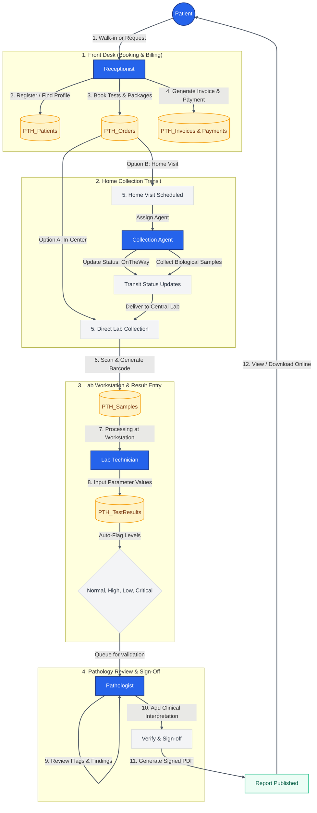

# Patholab Diagnostic Management Suite
## Operational Flowchart

Below is the visual operational lifecycle mapping patient check-in, billing, sample collection, lab analysis, pathologist verification, and final report publishing.

